# zt-rhaibu

OODA Workshop Factory -- a skill-driven pipeline for building OpenShift/RHOAI workshops from demo observations through to deployed, tested content.



## How it works

Each workshop follows the OODA loop. Run the skills in order -- and loop back when things need fixing.

| Phase | Skill | What happens |
|-------|-------|-------------|
| **Capture** | _manual_ | Record a demo video, `ffmpeg` split to keyframes |
| **Observe** | `/workshop-observe` | Analyze screenshots, extract user flows, write observations to RAC repo |
| **Orient** | `/workshop-orient` | Interview for requirements, create RAC artifacts (requirements, decisions, designs), validate |
| **Do** | `/workshop-do` | Scaffold showroom content + automation infra repos, `make build`, `helm lint`, `decided validate` |
| **Act** | `/workshop-act` | Deploy to prelude cluster, ArgoCD sync, Playwright browser tests, fix-and-test loop |
| **Loop Back** | _team review_ | Gaps? Re-Observe. Scope change? Re-Orient. Content fix? Re-Do. All green? Ship it. |

## Quick start

Install [asdecided-core](https://github.com/asdecided/core/releases) and ensure `decided` is on your PATH.

```bash
git clone <this-repo>
cd zt-rhaibu
```

Create screenshots from your demo video:

```bash
ffmpeg -i ~/Videos/zt-workbench-create.mkv \
  -vf "thumbnail=120,setpts=N/TB" \
  -vsync vfr rac/assets/keyframe-%03d.png
```

Then open Claude Code and run:

```bash
/workshop-observe <path-to-screenshots>
```

## Three repos per workshop

```
~/git/zt-<slug>-rac/          # planning (Requirements As Code)
~/git/zt-<slug>-showroom/     # content (Antora/AsciiDoc)
~/git/zt-<slug>-automation/   # infrastructure (ArgoCD app-of-apps)
```

This factory repo holds only skills and tooling -- no per-workshop state.

## Skills

### Pipeline skills

| Skill | Purpose |
|-------|---------|
| `workshop-observe` | Analyze demo screenshots into structured observations |
| `workshop-orient` | Plan the workshop with RAC artifacts |
| `workshop-do` | Scaffold content and infrastructure code |
| `workshop-act` | Deploy, test, and validate on a cluster |

### Domain skills

| Skill | Purpose |
|-------|---------|
| `openshift-workshop-builder` | Antora/showroom content scaffolding patterns |
| `openshift-4-21-expert` | OpenShift console flows and cluster admin |
| `openshift-ai-3-3-expert` | RHOAI workbenches, model serving, pipelines |
| `playwright-cli` | Browser automation for testing |

## Diagram source

The pipeline diagram is a Mermaid journey chart: [`docs/ooda-workshop-factory.mdd`](docs/ooda-workshop-factory.mdd)

Rebuild with:

```bash
npx @mermaid-js/mermaid-cli -i docs/ooda-workshop-factory.mdd -o images/ooda-workshop-factory.svg -b white
```
